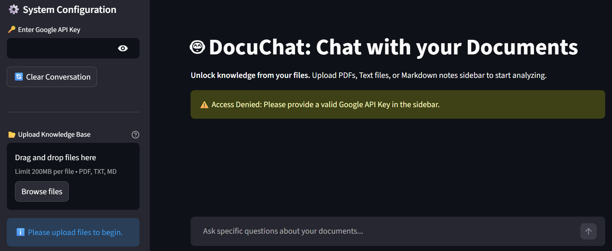
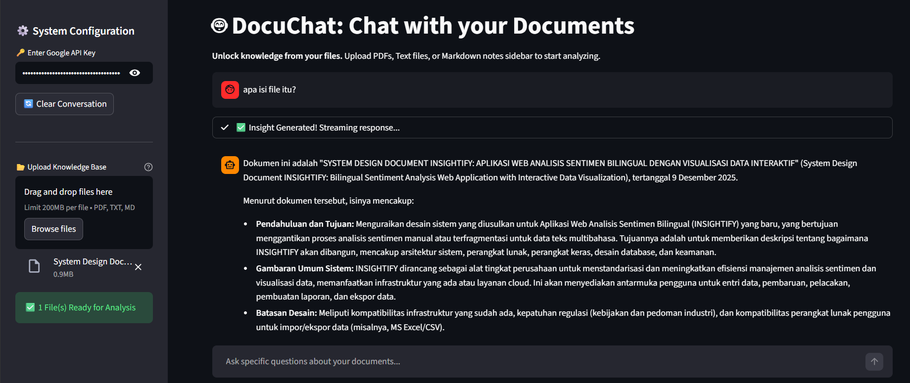
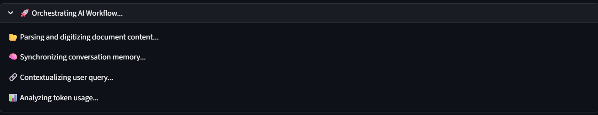
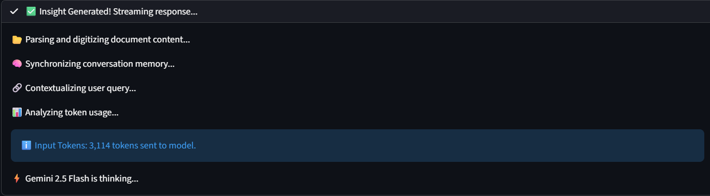

# 📚 Gemini Long-Context Chat (DocuChat AI)


## 📌 Overview
**DocuChat AI** is a streamlined document analysis tool that leverages the massive **Context Window** of Google's Gemini 2.5 Flash model. 

Unlike traditional RAG (Retrieval-Augmented Generation) systems that chunk documents into small pieces, this application takes a **"Full Context" approach**. It feeds the *entire* content of your uploaded documents (PDFs, TXT, MD) directly into the model's memory for every query.

**Why this approach?**
* **Zero Information Loss:** No risk of missing context due to poor chunking or retrieval algorithms.
* **Global Reasoning:** The AI understands the document as a whole, connecting information from Page 1 to Page 100.
* **Simplicity:** No Vector Databases (Pinecone/Chroma) or Embedding models required.

## ✨ Key Features

### 🧠 Full Context "Brute Force"
Leveraging Gemini's ability to handle millions of tokens, we send the **entire dataset** + **conversation history** with every prompt. This ensures the highest possible accuracy for complex queries involving multiple parts of a document.

### 🌐 Strict Language Enforcement
Unlike standard chatbots that often "slip" into the document's language, this app features a **System Instruction Override**. Users can toggle between **English** and **Indonesian**. The AI is strictly programmed to translate findings and answer in the selected language, even if the source documents are entirely in a different language (e.g., querying English journals in Indonesian).

### 📂 Multi-Format Support
* **PDFs:** Processed as binary streams for accurate parsing.
* **Text & Markdown:** Native handling with clear metadata tagging (`=== START OF FILE ===`) to help the AI distinguish sources.

### 📊 Token Awareness
Since this method is token-heavy, the app includes a built-in **Token Counter**. It transparently displays exactly how many tokens are being sent to Google's API for every message, helping you monitor usage.

### ⚡ Professional UX
* **Real-time Streaming:** Responses are streamed character-by-character.
* **Built-in Help Center:** Includes collapsible **"How to Use"** and **"FAQ"** sections in the sidebar, providing instant guidance on workflows and troubleshooting without leaving the app.
* **Status Indicators:** Visual feedback for every background process (Parsing -> Synchronizing Memory -> Token Calculation -> Generating).
* **Safety Rails:** Configured with `BLOCK_ONLY_HIGH` thresholds to ensure valid documents aren't blocked by over-sensitive filters.

## 🛠️ Tech Stack
* **Engine:** Google Gemini 2.5 Flash (via `google-genai` SDK).
* **Interface:** Streamlit.
* **Language:** Python 3.9+.

## ⚠️ Limitations (The "Cost" of Full Context)
While this method provides superior accuracy, it comes with trade-offs:
1.  **Token Usage:** Sending entire documents repeatedly consumes a high number of tokens.
2.  **Latency:** Response times may increase linearly with the size of uploaded documents.
3.  **Best Use Case:** Ideal for specific tasks (analyzing 1-5 papers/contracts) rather than querying massive libraries (1000+ books).

## 📦 Installation

1.  **Clone the Repository**
    ```bash
    git clone https://github.com/viochris/Gemini-Long-Context-Chat.git
    cd Gemini-Long-Context-Chat
    ```

2.  **Install Dependencies**
    ```bash
    pip install -r requirements.txt
    ```

3.  **Run the Application**
    ```bash
    streamlit run app.py
    ```

## 🚀 Usage Guide

1.  **Get API Key:** Obtain your free API Key from [Google AI Studio](https://aistudio.google.com/).
2.  **System Setup:** Enter the key and select your preferred **Response Language** (English/Indonesian) in the sidebar.
3.  **Upload:** Drag and drop your PDF, TXT, or MD files.
    * *Recommendation:* Upload **1-5 files** at a time.
    * *Why?* Exceeding this limit usually causes the application to **freeze** or hit a **connection timeout** during the upload process, significantly **confuses the AI** (reducing accuracy/hallucinations), and **rapidly drains your Token Quota**.
4.  **Chat:** Ask questions like:
    * *"Summarize the methodology in the PDF"*
    * *"Compare the conclusions of these two text files"*
    * *"Buatkan soal latihan dari materi ini"*
5.  **Switching Topics (Important):**
    When changing subjects (e.g., from Biology to Law), you **MUST** click **"🔄 Clear Conversation"** after removing old files. This prevents "Ghost Context" (hallucinations based on previously deleted files). 

## 💡 Best Practices & FAQ
The application includes a built-in **Help Center (How to Use & FAQ)** located at the bottom of the sidebar for quick reference. Here are the deeper technical details:

* **The "Ghost Context" Phenomenon (Why does it answer about File A when I ask about File B?):**  
    You might encounter a situation where you upload a new document (File B), but the AI answers using information from the previous document (File A).
    * *Why?* Merely deleting a file from the upload widget does **not** erase it from the AI's short-term memory (Session State). Since Gemini retains conversation history, the AI still "remembers" the old conversation context even after the file is removed.
    * *Solution:* You **MUST** click the **"🔄 Clear Conversation"** button to physically flush the memory buffer before starting a new topic.

* **File Quantity & Model Confusion:**
    * *Why limit files?* While Gemini has a large context window, uploading excessive files (e.g., >10 heavy PDFs) may lead to connection timeouts via Streamlit. Furthermore, this approach **consumes a massive amount of Tokens** and can **confuse the LLM** (especially with mixed topics). Stick to focused batches of documents.
    * *Result:* The model may struggle to retrieve specific details correctly because it is overwhelmed by too much "noise" from irrelevant documents. Keep your context focused.  

* **Creative Prompting:**  
    Beyond summarization, try using the AI as a study aid.
    * *Prompt:* "Generate 10 multiple-choice questions with answers based on this PDF."
    * *Prompt:* "Explain the concept of 'X' from the document as if I were 5 years old."

## 📷 Gallery

### 1. Initial State & Security

*Upon launching, the application locks functionality until a valid Google API Key is securely provided in the sidebar.*

### 2. Interactive Document Chat

*Once configured, users can upload documents and engage in a natural language conversation. The AI provides detailed answers grounded in the file content. As shown above, the system strictly enforces the selected **Response Language** (English), even when the user queries in a different language (Indonesian).*

### 3. AI Orchestration (In-Progress)

*The system transparently shows the "thinking" steps in real-time: parsing documents, synchronizing memory, and contextualizing the query.*

### 4. Completion & Token Analysis

*Once processing is complete, the status turns green ("Insight Generated") and displays the exact **Input Token Count**, giving users full visibility into API usage.*

---
**Author:** [Silvio Christian, Joe]
*"Sometimes, the best retrieval strategy is to just read everything."*
